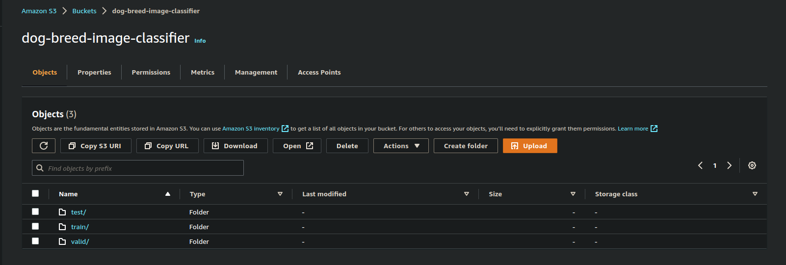
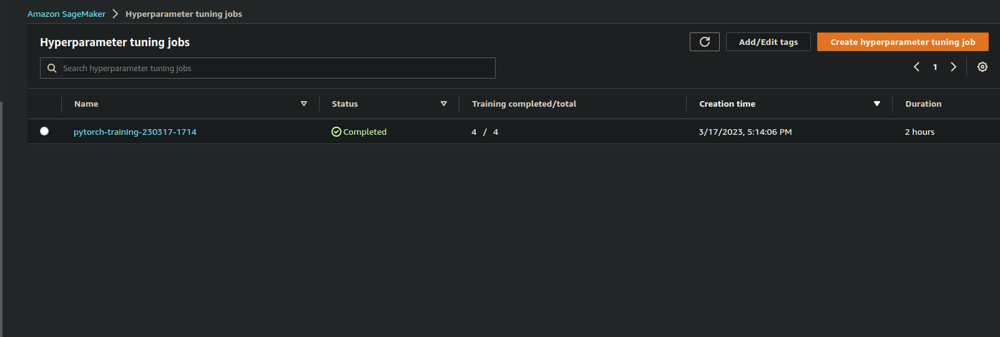
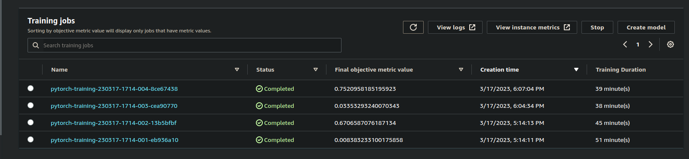
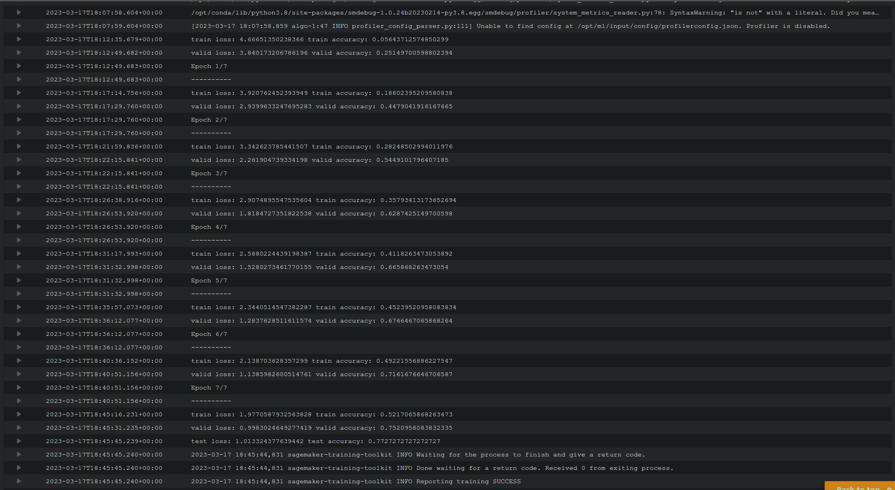
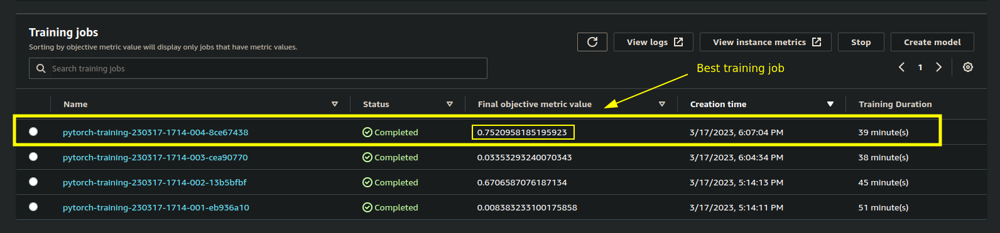
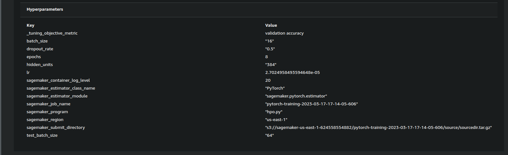
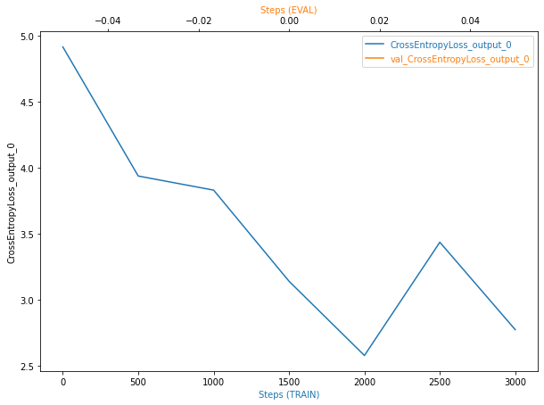
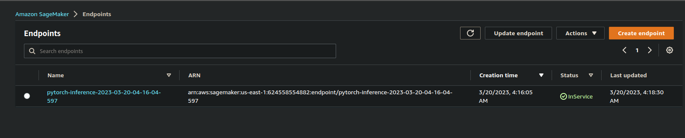

# Image Classification using AWS SageMaker

In this project, you will be using AWS Sagemaker to finetune a pretrained model that can perform image classification. You will have to use Sagemaker profiling, debugger, hyperparameter tuning and other good ML engineering practices to finish this project. The choice of dataset is up to you. For instance, you can use the [dog breed classication](https://s3-us-west-1.amazonaws.com/udacity-aind/dog-project/dogImages.zip) dataset to classify between different breeds of dogs in images.

## Project Set Up and Installation
1. Enter AWS through the gateway in the course and open SageMaker Studio.
2. Download the starter files | Clone [Github Repo](https://github.com/udacity/CD0387-deep-learning-topics-within-computer-vision-nlp-project-starter)
3. Complete the `hpo.py` file.
4. Complete the `train_model.py` file.
5. Open and complete `train_and_deploy.ipynb`. Select;
  a.`Python 3 (PyTorch 1.12 Python 3.8 GPU Optimized)` kernel.
  b.`ml.m3.medium` instance to power notebook run.

### Files
The following are python scripts that;
* `hpo.py` : contains functions used by hyperparameter jobs to train and validate the model.

* `train_model.py`: contains functions and code used by the training job to train and validate the model with the best hyperparameters obtained from the hyperaparameter tuning job.

* `inference.py`: contains function to load saved model, preprocess data and make predictions

The following is a jupyter notebook file that;
* `train_and_deploy.ipynb`: contains python code for each step in ML flow to train and deploy a pre-trained model


## Dataset
The provided dataset is the dogbreed classification dataset which can be found in the classroom. The project is designed to be dataset independent so if there is a dataset that is more interesting or relevant to your work, you are welcome to use it to complete the project.

If you choose to use the *dog breed classification* data, it contins images from 133 dog breeds divided into training, testing and validation datasets. [Download dog breed classification dataset](https://s3-us-west-1.amazonaws.com/udacity-aind/dog-project/dogImages.zip)

### Access
Upload the data to an S3 bucket through the AWS Gateway so that SageMaker has access to the data. 


## Hyperparameter Tuning

ResNet18 model with two fully-connected layers is used in this image classication project. ResNet18 is a convolutional neural network architecture that was introduced in 2015 as part of a paper called "Deep Residual Learning for Image Recognition". It is one of several ResNet architectures that were developed as part of this paper, but it is the smallest and most commonly used variant.The basic idea behind ResNet18 is to address the problem of vanishing gradients in deep neural networks.

The benefits of using ResNet18 include its high accuracy on image classification tasks, its relatively small size compared to other deep neural networks, and its ability to generalize well to new data. It is commonly used as a starting point for transfer learning in computer vision tasks, meaning that a pre-trained ResNet18 model can be fine-tuned on a new dataset with relatively few training examples. This makes it a popular choice for image classification, object detection, and other computer vision tasks.


The following hyperparameters were tuned;
* Epochs - *Ranges between 5 and 10*
* Learning rate - *Ranges between 0.00001 and 0.1*
* Dropput - *Probability rate of 20% and 50%*
* Hidden units - *Hidden unit nodes category; 256, 384, 512 and 640*
* Batch size - *Training batch size; 16, 32, 64*
* Test batch size - *Test batch size; 16, 32, 64*

```python
hyperparamater_ranges = {
    'epochs': IntegerParameter(5, 10),
    'lr': ContinuousParameter(1e-5, 0.1),
    'dropout_rate': CategoricalParameter([0.2, 0.5]),
    'hidden_units': CategoricalParameter([256, 384, 512, 640]),
    'batch_size': CategoricalParameter([16, 32, 64]),
    'test_batch_size': CategoricalParameter([16, 32, 64]),
}
```

##### Complete training jobs



##### logs metrics during the training process


##### Best training job

##### Best training job hyperparameters


#### Best hyperparameters:
```python
{'batch_size': 16,
 'dropout_rate': 0.5,
 'epochs': 8,
 'hidden_units': 384,
 'lr': 2.7024958493594648e-0,
 'test_batch_size': 64
 }
```

## Debugging and Profiling
##### Loss and accuracy curve of training and validation loops.


##### Plot Insight
Over the steps, we observe that train losses decresed sturdily but there is a sudden rise and fall. Sudden rise and fall at the end could signify model instability at the near end of the loop. Val losses did not plot and could be the debugger did not register the val losses.

To fix this, we could introduce additional FC layers, tweak the hidden nodes and tune the dropout rates.

#### Profiler Report
[Profiler HTML report](ProfilerReport/profiler-output/profiler-report.html)

## Model Deployment
Use `PyTorchModel` object to deploy the `inference.py` script;

```python
from sagemaker.pytorch import PyTorchModel
from sagemaker.serializers import JSONSerializer, IdentitySerializer
from sagemaker.deserializers import JSONDeserializer


model_deploy = PyTorchModel(
    entry_point = 'inference.py',
    role = role,
    model_data = best_estimator.model_data,
    framework_version = '1.12',
    py_version = 'py38',
)
```

Next deploy model with;
```python
# Deploy your model to an endpoint
predictor = model_deploy.deploy(
    instance_type='ml.m5.large',
    initial_instance_count=1,
    serializer = IdentitySerializer("image/jpg"),
    deserializer = JSONDeserializer(),
)
```

Query endpoint with sample input;

```python
from train_model import create_data_loaders

# fetch test set batch
data, _ = create_data_loaders('dogImages', 8)

# get cglasses
test_classes = {v: k for k, v in data['test'].dataset.class_to_idx.items()}

# get names of test images
test_image = os.listdir('testImages')

for sample in test_image:
    # skip hidden file
    if sample.startswith('.'):
        continue

    image_path = f'testImages/{sample}'
    print('Sample Image (test): ', image_path)

    with open(image_path, 'rb') as img:
        payload = img.read()

    response = predictor.predict(payload)
    idx = torch.argmax(torch.tensor(response), 1)
    predict_class = test_classes.get(idx.item())

    probs = torch.nn.functional.softmax(torch.tensor(response), 1).squeeze()
    pred_prob = probs[idx.item()]

    preview = Image.open(image_path)
    plt.imshow(preview)
    print(f"Prediction: {predict_class}\nProbability: {pred_prob: .4f} \n")
```


##### Output


##### Deplyed active endpoint in Sagemaker.

